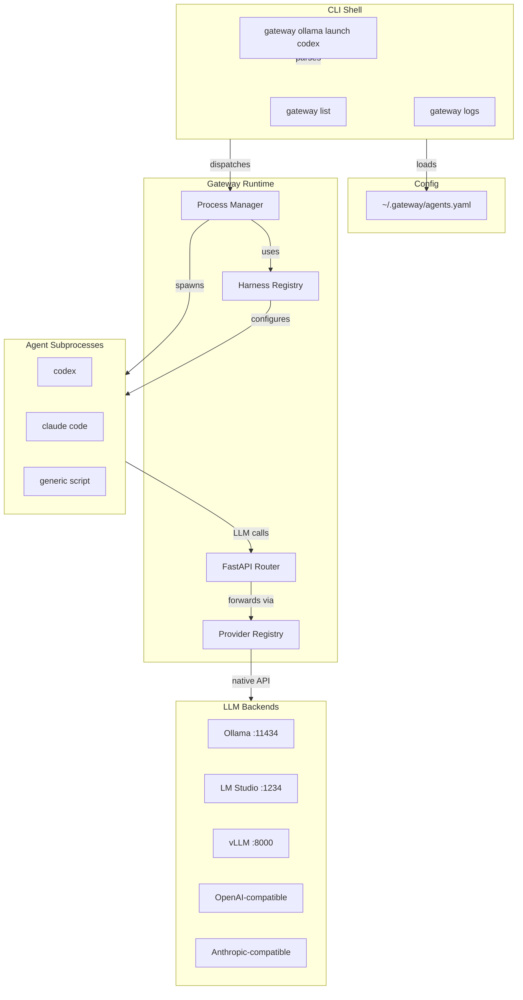
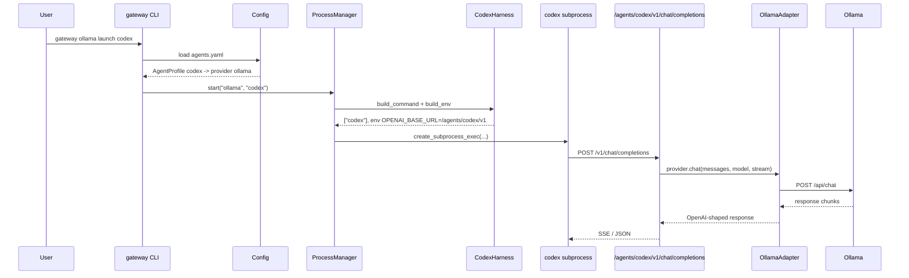
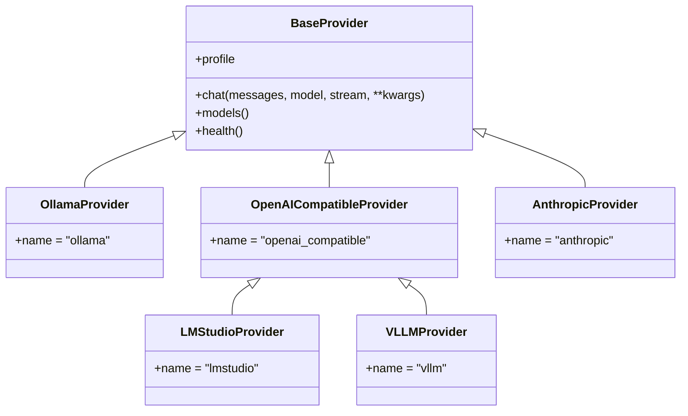

# Gateway Architecture Diagrams

## 1. High-Level Component Diagram



## 2. Request Flow for `gateway ollama launch codex`



## 3. Provider Adapter Inheritance



## 4. Endpoint Mapping

```mermaid
flowchart LR
    A["/health"] --> GW["Gateway health"]
    B["/agents/{id}/v1/chat/completions"] -- OpenAI shim
    C["/agents/{id}/v1/messages"] -- Anthropic shim
    D["/agents/{id}/v1/models"] -- Optional model list proxy
    E["/agents/{id}/{custom}"] -- User-defined static/proxy endpoint

    B --> P["Provider registry"]
    C --> P
    D --> P
    E --> H["Custom handler"]
```
